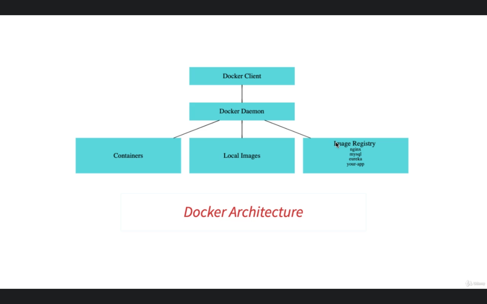

# **Commands**

**Docker version**
docker --version

# **Image commands**

**Run docker image** :
docker run -p 5000:5000 {repo}/hello-world-python:0.0.1.RELEASE docker run -d -p 5001:5000

**Run docker on detached mode** :
docker run -d -p 5001:5000 {dockehub image}

**docker logs** :
dokcer logs -f {container-id}

**check images running on ur local**
docker images

**search an image**
docker search {image}

**check content inside image**
docker image inspect {image id}

**How to remove an image ?**
docker image remove {image id}

# **Container commands**

**check container running**
docker container -ls

**check all the containers**
docker container ls -a

**stop a running container**
docker container stop {imageid}

**pause container:**
docker container pause {container id}

**unpause container**
docker container unpause {container id}

**kill docker container**
docker container kill {container id}

# **Docker system commands**

1)Check disk usage: docker system df

2)Check events : docker system events (docker commands are logged here )

3)docker stats : To allocate CPU memory : docker container run -p 5000:5000 -m {memory size} {repo}

**More on docker-hub:**
https://docs.docker.com/docker-hub/

# **Docker Architecture**

**Docker client** - Where docker commands are executed

**Docker Daemon** - The process that is repsonsible for downloading/ running /checking local images

**Container** : Once the image is downloaded from hub daemon is responsible for starting container

# **Questions And Ans:**

1)Can we remove docker image wher container is stopped or running? A: No , we need to remove the container then only we
can delete the docker image from local

2)What happens when container is paused? A:Container will not serve any request and will be timed-out

3)Difference between docker container kill and stop? A: Kill is nothing but sigkill that stops the application in
ungracefull way and docker container stop will stop the application in gracefull way

4)How to check disk usage, active images , events in docker? A:Use docker system commands

5)How to allocate memory to container? A: docker container -p run port:port -m 512m {repo}

6)In docker file what is difference between CMD and Entrypoint to launch an application ? A: CMD will get overriden if
we write any command while executing docker file but not the case with Entry Point

